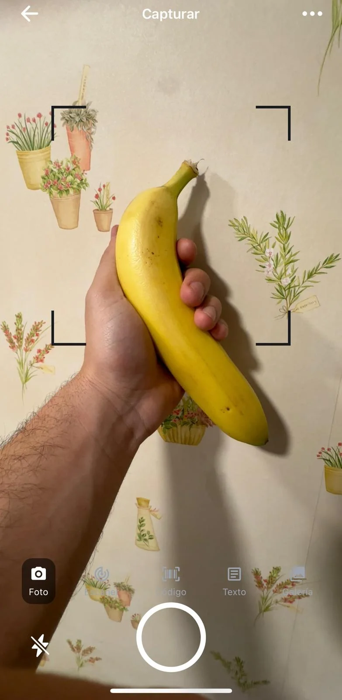
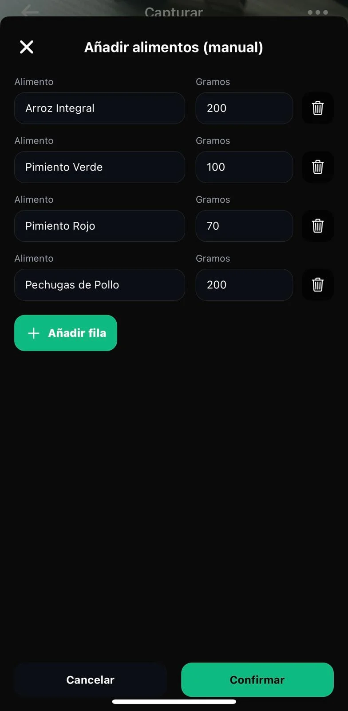
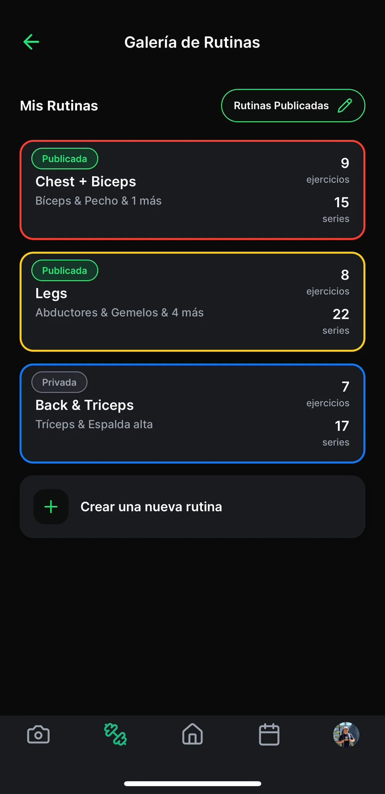
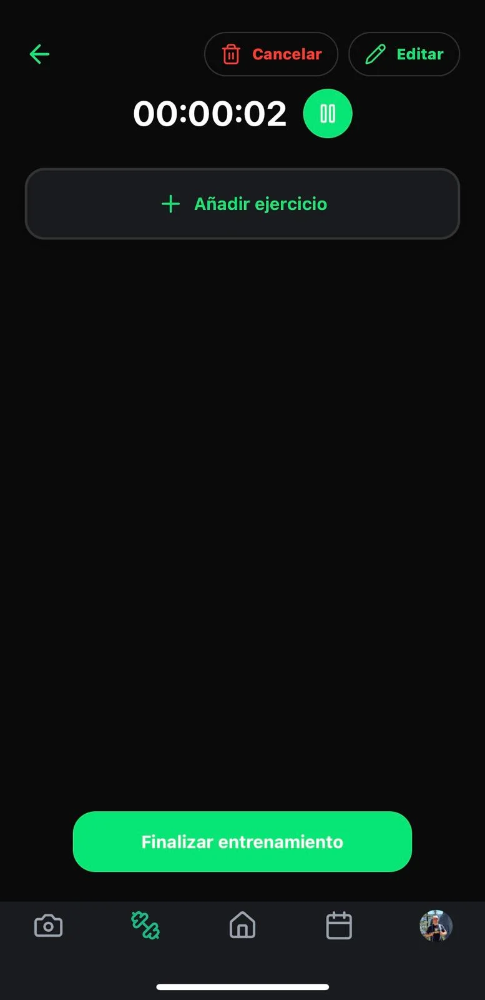
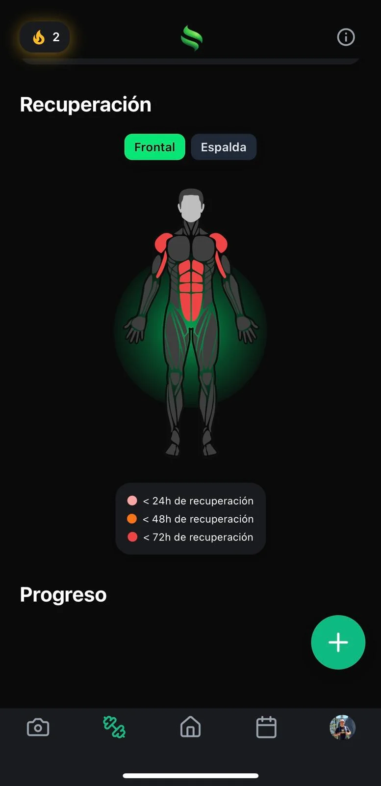
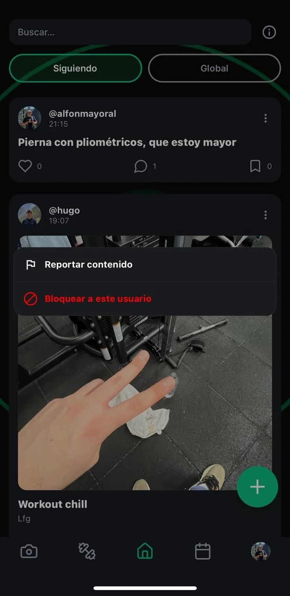
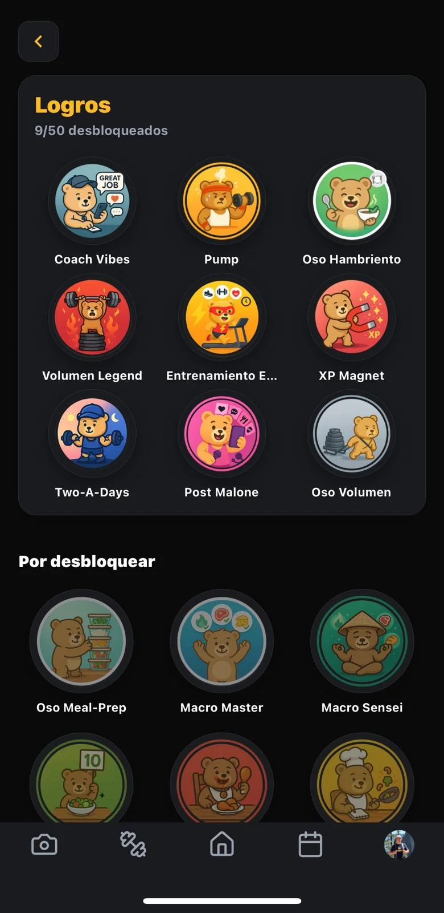
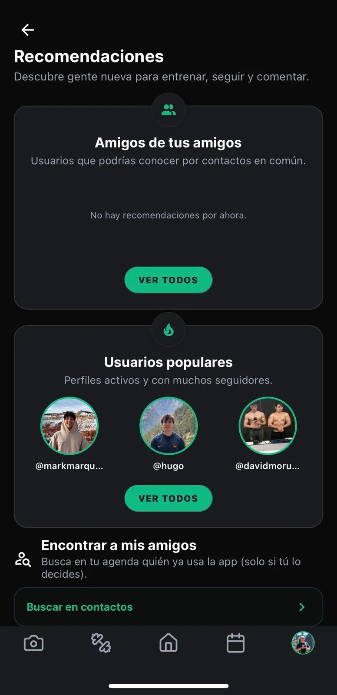

<div align="center">


# Spotter AI

### The all-in-one fitness, nutrition and health social app — powered by AI

[](https://apps.apple.com/us/app/spotter-ai/id6756170372)
[](https://play.google.com/store/apps/details?id=com.alfonmayoral.spotteria)
[](https://www.spotter-ai.app/)

[](https://apps.apple.com/us/app/spotter-ai/id6756170372)
[](#)
[](#)
[](#)
[](#)
[](#about-this-repository)

[](https://reactnative.dev/)
[](https://expo.dev/)
[](https://www.typescriptlang.org/)
[](https://supabase.com/)
[](https://zustand-demo.pmnd.rs/)
[](#)
[](https://www.revenuecat.com/)
[](https://docs.expo.dev/eas/)
[](#)

</div>

---

## About this repository

**This is the public showcase repository for Spotter AI.** The actual production source code lives in a private repository and is not published here — what you'll find below is an end-to-end architectural and product walkthrough, written to give recruiters, engineers and curious users a clear sense of what was built, how it's built, and why.

Everything in this README — screenshots, statistics, architectural notes — is taken directly from the production codebase as of April 2026.

---

## Table of contents

- [Why Spotter exists](#why-spotter-exists)
- [The 30-second pitch](#the-30-second-pitch)
- [System architecture](#system-architecture)
- [Repository layout](#repository-layout)
- [Feature deep-dives](#feature-deep-dives)
  - [Nutrition — AI food analysis with macro tracking](#nutrition--ai-food-analysis-with-macro-tracking)
  - [Workout — full training engine with rest, supersets and history](#workout--full-training-engine-with-rest-supersets-and-history)
  - [Social feed — your fitness community in one place](#social-feed--your-fitness-community-in-one-place)
  - [Streaks, achievements & league](#streaks-achievements--league)
  - [Calendar — every minute of training and every meal in one view](#calendar--every-minute-of-training-and-every-meal-in-one-view)
  - [Profile & analytics — your body and habits, quantified](#profile--analytics--your-body-and-habits-quantified)
- [Tech stack at a glance](#tech-stack-at-a-glance)
- [Engineering highlights](#engineering-highlights)
- [About the team](#about-the-team)

---

## Why Spotter exists

I'm Alfonso, an engineer and lifelong athlete. For years I lived with the same frustration thousands of other people complain about: **to track your fitness life properly you end up paying five or six different premium subscriptions** — one for workouts, one for nutrition, one for streaks, one for body composition, one for the social side, one for AI coaching. None of them talk to each other, the data is fragmented across silos, and the experience is full of dark patterns and shallow features hiding behind paywalls.

I wanted **one beautifully designed app** that did the heavy lifting end-to-end: log a meal by taking a photo of it, track every set in the gym, see your real progress over weeks and months, build streaks that actually motivate you, and share the journey with the people who matter — without paying a fortune or stitching together a Frankenstein of apps.

So I built it. Spotter AI is now in production on iOS and Android, with **1,000+ downloads** and **400+ weekly active users** across both platforms.

---

## The 30-second pitch

- **Nutrition tracking with AI**: snap a photo of your plate (or scan a barcode, or describe it in text), get a macro-by-macro breakdown in seconds powered by GPT-4o Vision.
- **Full workout engine**: routines, supersets, rest timers, cardio, body part heatmaps, plate calculators, video playback per exercise.
- **Social feed**: posts, likes, comments, profiles, contact-based recommendations, instagram-story sharing.
- **Streaks, league and achievements**: gamification that actually rewards consistency, not vanity metrics.
- **Calendar view**: every workout, every meal, every weight log in a single timeline.
- **Coaching profile**: weight tracking, body composition, AI-generated recommendations.
- **Production-grade ops**: Supabase Postgres + Edge Functions, RevenueCat subscriptions, push notifications, OTA updates, i18n in English and Spanish.

---

## System architecture

```
┌──────────────────────────────────────────────────────────────────────────┐
│                                CLIENT                                    │
│                        React Native + Expo SDK 54                        │
│                          (iOS · Android · Web)                           │
│                                                                          │
│   ┌──────────────────────────────────────────────────────────────────┐   │
│   │   Expo Router (file-based routing)                               │   │
│   │   (tabs)   nutrition · workout · feed · streaks · calendar       │   │
│   │   (modals) compose-post · paywall · share-post                   │   │
│   └──────────────────────────────────────────────────────────────────┘   │
│                                                                          │
│   ┌──────────────────────────────────────────────────────────────────┐   │
│   │   State — 21 domain stores (Zustand) with persistence            │   │
│   │   nutritionStore · workoutStore · streakStore · socialStore ...  │   │
│   └──────────────────────────────────────────────────────────────────┘   │
│                                                                          │
│   ┌──────────────────────────────────────────────────────────────────┐   │
│   │   UI — 370+ .tsx components across 17 feature modules            │   │
│   │   Native APIs: Camera · Notifications · Haptics · Auth · Media   │   │
│   └──────────────────────────────────────────────────────────────────┘   │
└──────────────────────────────────────────────────────────────────────────┘
                                    │
                                    │  HTTPS / Realtime channels
                                    ▼
┌──────────────────────────────────────────────────────────────────────────┐
│                              BACKEND                                     │
│                       Supabase (Postgres + Edge)                         │
│                                                                          │
│   Postgres schema with RLS · realtime subscriptions · storage buckets    │
│                                                                          │
│   ┌─────────────────────────── Edge Functions ──────────────────────┐    │
│   │  analyze-food-v2        analyze-barcode      analyze-manual     │    │
│   │  nutrition-service      translate-food-names weight-prompt      │    │
│   │  moderate-user-media    discover-contacts    set-phone-number   │    │
│   │  send-push-from-notification    delete-account    rc-webhook    │    │
│   │  sync-from-revenuecat   sync-subscription   batch-sync-subs     │    │
│   │  expire-pro-trials      send-feedback                           │    │
│   └─────────────────────────────────────────────────────────────────┘    │
└──────────────────────────────────────────────────────────────────────────┘
                                    │
                ┌───────────────────┼────────────────────┐
                ▼                   ▼                    ▼
       ┌──────────────┐    ┌──────────────┐     ┌──────────────┐
       │  OpenAI API  │    │  RevenueCat  │     │  Expo Push   │
       │  GPT-4o      │    │  Subs (iOS + │     │  Notifications│
       │  Vision      │    │  Google Play)│     │              │
       └──────────────┘    └──────────────┘     └──────────────┘
```

**Key decisions**

- **Expo SDK 54 + EAS Build**. One codebase, two stores, one OTA update pipeline. No native modules we don't strictly need — every new feature ships in days, not weeks.
- **Supabase over a custom Node backend**. Postgres + Row-Level Security + auto-generated APIs + Edge Functions cover 95% of what a backend needs. We only write functions for the things Postgres can't do alone (AI calls, webhooks, push fan-out, subscription sync).
- **Zustand over Redux/Context**. 21 lean stores, each owning a single domain. Persisted via AsyncStorage. Selectors instead of `useContext` to avoid re-renders.
- **GPT-4o Vision for food recognition**. A single multimodal call returns macros, portion estimates and a name in 2–4 seconds. Cheaper, faster and more accurate than any commercial food-DB API at our scale.
- **Strict TypeScript, ESLint + Prettier on every commit via Husky + lint-staged**. 370 `.tsx` files, near-zero `any`, type-safe Supabase generated clients.

---

## Repository layout

```
spotter/
├── app/                      Expo Router routes (file-based)
│   ├── (tabs)/               Bottom-tab routes:
│   │   ├── nutrition/        meal logging · barcode · review · capture
│   │   ├── workout/          live workouts · routines · exercise picker · history
│   │   ├── feed/             posts · search · profiles
│   │   ├── streaks/          challenges · league · achievements · shop
│   │   ├── calendar.tsx
│   │   ├── profile/          public profile · settings · recommendations · coaching
│   │   └── dashboard.tsx
│   ├── (modals)/             paywall · compose-post · share-post
│   ├── auth.tsx              email/Apple/Google sign-in
│   ├── reset-password.tsx
│   ├── onboarding-pro.tsx
│   └── onboarding-avatar-capture.tsx
│
├── components/               370+ .tsx components, grouped by feature
│   ├── nutrition/  workout/  social/  streaks/  profile/  charts/
│   ├── coaching/   achievements/  onboarding/  subscription/  tutorial/
│   ├── settings/   updates/  background/  logo/  ui/  dev/
│   └── ...
│
├── store/                    21 Zustand stores (one per domain)
│   nutritionStore · workoutStore · routineStore · setStore · streakStore
│   socialStore · profileStore · subscriptionStore · notificationStore ...
│
├── lib/                      Cross-cutting helpers
│   supabase.ts · achievements.ts · dataCache.ts · imageCache.ts
│   postLinks.ts · postShare.ts · shareToInstagramStories.ts
│
├── supabase/                 Backend (Postgres + Edge Functions)
│   ├── functions/            18 deployed Edge Functions (see architecture diagram)
│   ├── migrations/           Postgres schema migrations
│   └── seeds/                Reference data (exercises, foods, achievements)
│
├── hooks/  i18n/  theme/  types/  utils/  constants/  config/
├── plugins/                  Custom Expo config plugins
├── remotion/                 Programmatic video generation (workout recaps)
├── scripts/                  asset pipelines (WebP conversion, achievement generation)
└── native/                   Native-side overrides (Android resources, build hooks)
```

---

## Feature deep-dives

### Nutrition — AI food analysis with macro tracking

> Log what you eat in any of three ways, see exactly how it breaks down into calories and macros, and watch the rings close.

<table>
<tr>
<td width="33%" align="center"><br/><sub><b>Photo</b><br/>Snap a plate · GPT-4o Vision returns macros</sub></td>
<td width="33%" align="center"><br/><sub><b>Text</b><br/>Describe the meal in natural language</sub></td>
<td width="33%" align="center"><br/><sub><b>Review draft</b><br/>Edit portions before saving</sub></td>
</tr>
<tr>
<td align="center"><br/><sub><b>Concentric macro rings</b><br/>Protein · carbs · fat at a glance</sub></td>
<td align="center"><br/><sub><b>Daily breakdown</b><br/>Per-meal bars across the day</sub></td>
<td align="center"><br/><sub><b>Weekly calendar</b><br/>Adherence at a glance</sub></td>
</tr>
</table>

**Under the hood**

- Three Edge Functions handle the analysis pipeline:
  - `analyze-food-v2` — multimodal GPT-4o Vision call. Image is uploaded to Supabase Storage, signed URL passed to OpenAI, structured JSON returned with name, portion, macros and confidence per item.
  - `analyze-barcode` — Open Food Facts lookup + AI fallback for unknown barcodes.
  - `analyze-manual` — text-to-macros for "two slices of pizza and a Coke" style entries.
- `nutritionStore` (Zustand) holds the day's meals, weight logs and water intake; selectors compute the macro totals on every read.
- `ConcentricMacroRings`, `MacroCard`, `MealCard`, `WeeklyNutritionCalendar` are the main UI components. The rings use `react-native-svg` with custom path interpolation animated via `react-native-reanimated`.
- Meals are persisted in Postgres with full audit history (you can edit a meal three days later and the rings recompute backwards).
- Multi-plate meals: 2026-04 migration `multi_plate_meals.sql` enabled tracking shared meals where one plate has multiple components.

---

### Workout — full training engine with rest, supersets and history

> Build your routine, then live-track every set, every rep, every second of rest. The app remembers your last weight, suggests progression, and times you between sets.

<table>
<tr>
<td width="33%" align="center"><br/><sub><b>Routines</b><br/>Plan and reuse workouts</sub></td>
<td width="33%" align="center"><br/><sub><b>Exercise picker</b><br/>Search by muscle group or name</sub></td>
<td width="33%" align="center"><br/><sub><b>Start workout</b><br/>Live session with auto-rest</sub></td>
</tr>
<tr>
<td align="center"><br/><sub><b>Set tracking</b><br/>Weight · reps · RPE · history hints</sub></td>
<td align="center"><br/><sub><b>Summary</b><br/>Volume · PRs · time per muscle</sub></td>
<td align="center"><br/><sub><b>Calendar</b><br/>Training adherence at a glance</sub></td>
</tr>
<tr>
<td colspan="3" align="center"><br/><sub><b>Recovery view</b> — body heatmap shows which muscle groups have been hit and which need a break</sub></td>
</tr>
</table>

**Under the hood**

- Five Zustand stores power the workout engine: `workoutStore` (session lifecycle), `routineStore` (templates), `exerciseStore` (catalogue), `setStore` (live set entry), `cardioSetStore` (cardio), `restTimerStore` (rest), and `coachingStore` (suggestions).
- Live workout screen (`ActiveWorkoutScreen.tsx`) handles supersets, drop-sets, rest pauses and per-set notes. Pulls last-session values from Postgres on mount so the user sees their previous numbers immediately.
- Background haptics + push notification fires when the rest timer ends so the user can put the phone away.
- Recovery heatmap powered by `react-native-body-highlighter`. Each completed exercise contributes weighted volume to its primary and secondary muscle groups; a decay function over the last 7 days produces the visualisation.
- Workout summaries are rendered with `remotion/` for a future shareable-video feature.

---

### Social feed — your fitness community in one place

> Post photos and progress updates, comment, like, follow contacts you already know, share to Instagram stories with one tap.

<table>
<tr>
<td width="50%" align="center"><br/><sub><b>Feed</b><br/>Friends and people you follow</sub></td>
<td width="50%" align="center"><br/><sub><b>Discover</b><br/>Find users by handle, name or contacts</sub></td>
</tr>
<tr>
<td align="center"><br/><sub><b>Reactions</b><br/>Like, comment, save</sub></td>
<td align="center"><br/><sub><b>Moderation</b><br/>Report inappropriate content (Apple/Google compliant)</sub></td>
</tr>
</table>

**Under the hood**

- `socialStore` + `composeStore` coordinate feed state, drafts and uploads.
- Posts live in Postgres with public-by-default RLS; comments and likes are separate tables with foreign keys + cascade.
- Contact-based discovery uses the `discover-contacts` Edge Function: device contacts are hashed locally before being sent, then matched against the same hash stored against existing users (privacy-preserving).
- Moderation pipeline (`moderate-user-media` Edge Function) runs newly uploaded media through automated content checks before they appear in the feed — required for App Store / Play Store compliance.
- Story sharing via `shareToInstagramStories.ts` deep-links the user out to the IG composer with their workout summary pre-loaded as a background.

---

### Streaks, achievements & league

> Show up every day, build a streak, climb the league, unlock achievements. Gamification that rewards real consistency, not vanity logins.

<table>
<tr>
<td width="33%" align="center"><br/><sub><b>Daily streak</b><br/>Don't break the chain</sub></td>
<td width="33%" align="center"><br/><sub><b>Achievements</b><br/>Unlockable milestones across all features</sub></td>
<td width="33%" align="center"><br/><sub><b>Weekly league</b><br/>Compete against a small bracket of users</sub></td>
</tr>
<tr>
<td colspan="3"></td>
</tr>
<tr>
<td align="center"><br/><sub><b>Challenges</b><br/>Time-limited goals with bonus XP</sub></td>
<td align="center"><br/><sub><b>Calendar view</b><br/>See every active day at a glance</sub></td>
<td align="center"><sub>&nbsp;</sub></td>
</tr>
</table>

**Under the hood**

- `streakStore` + `achievementStore` keep gamification state in sync with backend triggers.
- Achievements are defined declaratively in `assets/images/achievements` + JSON metadata; the `gen:achv` script (`scripts/generate-achievement-assets.ts`) regenerates the asset pipeline at install time.
- League membership is recomputed weekly on the backend; users are grouped into brackets of ~20 with promotion/relegation based on weekly XP.
- Daily streak grace: one "freeze" per week so a single missed day doesn't reset everything — measured behavioural impact on retention.

---

### Calendar — every minute of training and every meal in one view

> One unified calendar where workouts, nutrition logs, weight checkins and streak days all live together.

<table>
<tr>
<td width="33%" align="center"><br/><sub><b>Month</b><br/>Birds-eye view of the whole month</sub></td>
<td width="33%" align="center"><br/><sub><b>Week</b><br/>Side-by-side compare across days</sub></td>
<td width="33%" align="center"><br/><sub><b>Day summary</b><br/>Macros · training time · weight</sub></td>
</tr>
</table>

**Under the hood**

- Pure-client calendar. All three views read from cached Supabase queries (`dataCache.ts`).
- Calendar cells render compact "summary" badges (calories ring · workout chip · streak fire) computed from store selectors — no extra round-trips when scrolling between months.
- Date logic in `dayjs` to keep bundle size down vs `moment`.

---

### Profile & analytics — your body and habits, quantified

> Your public profile, plus the private dashboard that shows your real progress: weight, body composition, AI coaching suggestions, and the routines you've built.

<table>
<tr>
<td width="33%" align="center"><br/><sub><b>Settings</b><br/>Account · units · privacy</sub></td>
<td width="33%" align="center"><br/><sub><b>Notifications</b><br/>Per-channel push controls</sub></td>
<td width="33%" align="center"><br/><sub><b>Your posts</b><br/>Public grid view</sub></td>
</tr>
<tr>
<td align="center"><br/><sub><b>Your routines</b><br/>Reusable workout templates</sub></td>
<td align="center"><br/><sub><b>AI coaching</b><br/>Personalised next steps</sub></td>
<td align="center"><sub>&nbsp;</sub></td>
</tr>
</table>

**Under the hood**

- `profileStore` + `coachingStore` + `recommendationsStore` + `comparisionMetricsStore` (sic — historical typo kept for stability) coordinate the analytics surface.
- Weight prompt: the `weight-prompt` Edge Function schedules a smart reminder once per week when no log is detected; the prompt is dismissable per-user via `notificationStore`.
- Recommendations engine: rule-based + GPT-generated tips fed off the last 14 days of workout/nutrition data. Returns a small ranked list (max 3) so the user is never overwhelmed.
- Configuration screen wires up `expo-store-review`, `expo-secure-store`, `expo-clipboard`, RevenueCat subscription management, account deletion (GDPR compliant via the `delete-account` Edge Function), and 2026's mandatory App Store age rating flow.

---

## Tech stack at a glance

| Layer                  | What we use                                                                                 |
| ---------------------- | ------------------------------------------------------------------------------------------- |
| **Mobile framework**   | React Native 0.81 · Expo SDK 54 · Expo Router (file-based)                                  |
| **Language**           | TypeScript 5.9 (strict mode)                                                                |
| **State**              | Zustand 5 — 21 domain stores with AsyncStorage persistence                                  |
| **UI / Animation**     | `react-native-reanimated` · `react-native-svg` · `react-native-paper` · Lucide icons        |
| **Charts**             | `react-native-chart-kit` · `react-native-svg-charts` · `react-native-body-highlighter` · `@salmonco/react-native-radar-chart` |
| **Backend**            | Supabase — Postgres + Auth + Realtime + Storage + 18 Edge Functions                          |
| **AI**                 | OpenAI GPT-4o (Vision + text) for food analysis, recommendations, weight prompts            |
| **Subscriptions**      | RevenueCat (App Store + Google Play, unified analytics + webhooks)                          |
| **Auth**               | Email · Apple · Google · phone (libphonenumber-js)                                          |
| **Push notifications** | Expo Push Service with backend fan-out via `send-push-from-notification`                    |
| **Build & release**    | EAS Build · EAS Submit · EAS Update (OTA)                                                   |
| **i18n**               | i18next + i18next-icu, EN + ES (auto-scanned via `i18next-scanner`)                         |
| **Video**              | `expo-video` for exercise demos · `remotion` for programmatic workout recaps                |
| **Quality**            | ESLint 9 · Prettier · Husky · lint-staged · `tsc --noEmit` on every commit                  |

---

## Engineering highlights

- **748 commits across 106 pull requests, 10 months of iteration.** A live, in-store product — not a demo.
- **370+ TypeScript files, 17 feature modules, 21 state stores.** All strict-typed, all linted, all formatted on commit.
- **18 Supabase Edge Functions in production.** AI calls, RevenueCat webhooks, push fan-out, content moderation, account deletion, subscription sync — none of it living on a server we have to babysit.
- **GPT-4o Vision food pipeline** running at ~3 s p50 latency end-to-end (capture → analyze → review draft).
- **Native modules only when strictly necessary** — every other capability comes from Expo SDK 54, keeping OTA updates available for 95% of changes.
- **App Store + Play Store compliance done properly**: content moderation, contact discovery with hashed-before-send, account deletion endpoint, mandatory age rating flow, per-channel notification controls.
- **Localisation in two languages from day one**, with `i18next-scanner` automatically detecting missing keys on each commit.

---

## About the team

Spotter AI is built and operated by **Alfonso Mayoral** ([alfonsomayoral29@gmail.com](mailto:alfonsomayoral29@gmail.com)) — founder, full-stack engineer, designer, and the user the app was first built for.

- 🌐 [spotter-ai.app](https://www.spotter-ai.app/)
- 🍎 [App Store](https://apps.apple.com/us/app/spotter-ai/id6756170372)
- 🤖 [Google Play](https://play.google.com/store/apps/details?id=com.alfonmayoral.spotteria)
- 👤 Personal portfolio: [alfonsomayoral.com](https://portfolio-website-two-rho-44.vercel.app/)

---

<div align="center">

_Built with care. Shipped to real users. Iterated weekly._

</div>
