<div align="center">


# Spotter AI

### Fitness, nutrition and a fitness social network — all in one app, powered by AI.

[](https://apps.apple.com/us/app/spotter-ai/id6756170372)
[](https://play.google.com/store/apps/details?id=com.alfonmayoral.spotteria)
[](https://www.spotter-ai.app/)

[](https://apps.apple.com/us/app/spotter-ai/id6756170372)
[](#)
[](#)
[](#)
[](#)
[](#about-this-repository)

[](https://reactnative.dev/)
[](https://expo.dev/)
[](https://www.typescriptlang.org/)
[](https://supabase.com/)
[](https://zustand-demo.pmnd.rs/)
[](#)
[](https://www.revenuecat.com/)
[](https://docs.expo.dev/eas/)
[](#)

</div>

---

## About this repository

**This is the public showcase for Spotter AI.** The production source code is private — this repo is a full walkthrough of *what* was built, *how* it works under the hood, and *why* it exists. Everything you read here is pulled directly from the live codebase as of April 2026, after ten months of iteration with real users on both App Store and Google Play.

---

## Table of contents

- [The story behind it](#the-story-behind-it)
- [What you can do with it](#what-you-can-do-with-it)
- [System architecture](#system-architecture)
- [Repository layout](#repository-layout)
- [Inside the app](#inside-the-app)
  - [🥗 Nutrition](#-nutrition)
  - [💪 Workout](#-workout)
  - [👥 Social feed](#-social-feed)
  - [🔥 Streaks, league & achievements](#-streaks-league--achievements)
  - [📅 Calendar](#-calendar)
  - [👤 Profile & analytics](#-profile--analytics)
- [Tech stack](#tech-stack)
- [By the numbers](#by-the-numbers)
- [Get in touch](#get-in-touch)

---

## The story behind it

If you've ever tried to track your fitness life properly, you know the drill: one app for the gym, another for nutrition, a third for your weight, a fourth for habit streaks, a fifth for sharing progress with friends — each one asking for its own premium subscription and none of them talking to each other. Months go by, your data lives in six different silos, and most of what you actually want is hidden behind a paywall.

I'd been living with that frustration for years, so one weekend I sat down and started building the app I always wished existed. **One place** to snap a photo of a meal and get the macros, log every set at the gym, see your progress over months, build streaks that actually motivate you, and share the journey with the people who matter — without paying a fortune for it.

Ten months later, Spotter AI is live on iOS and Android with **1,000+ downloads** and **400+ monthly active users**, and people are using it daily.

This repo tells the full story of how it was built.

---

## What you can do with it

| | |
|---|---|
| 📸 **Snap a meal** | Photo, barcode or text. GPT-4o Vision returns macros in 3 seconds. |
| 🏋️ **Track every set** | Live workouts with rest timers, supersets, history hints and progression cues. |
| 👥 **Share the journey** | A real social feed for fitness — posts, likes, profiles, contact-based discovery. |
| 🔥 **Build streaks** | Daily streaks, weekly league, achievements that reward consistency over vanity. |
| 📅 **See it all together** | One unified calendar: workouts, meals, weight, every active day. |
| 📊 **Watch real progress** | Body composition, weight trends, AI coaching tips based on what you actually do. |

---

## System architecture

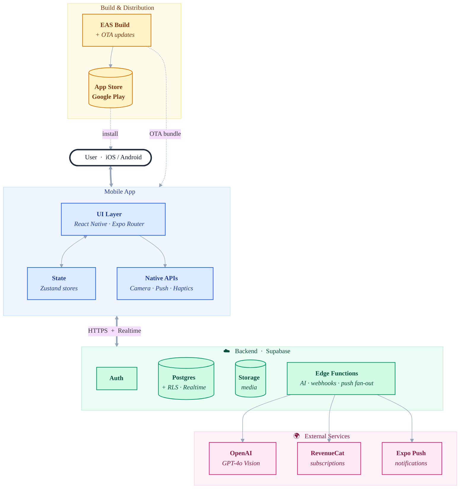
```mermaid
%%{init: {
  'theme': 'base',
  'themeVariables': {
    'fontFamily': 'Inter, system-ui, -apple-system, sans-serif',
    'fontSize': '15px',
    'lineColor': '#94a3b8'
  }
}}%%
flowchart TB

  User(["👤 &nbsp; User &nbsp;·&nbsp; iOS / Android"])

  subgraph APP[" &nbsp;&nbsp;📱 &nbsp; Mobile App &nbsp;&nbsp; "]
    direction TB
    UI["<b>UI Layer</b><br/><i>React Native · Expo Router</i>"]
    State["<b>State</b><br/><i>Zustand stores</i>"]
    NativeAPI["<b>Native APIs</b><br/><i>Camera · Push · Haptics</i>"]
    UI <--> State
    UI --> NativeAPI
  end

  subgraph BACK[" &nbsp;&nbsp;☁️ &nbsp; Backend &nbsp;·&nbsp; Supabase &nbsp;&nbsp; "]
    direction LR
    Auth["<b>Auth</b>"]
    DB[("<b>Postgres</b><br/><i>+ RLS · Realtime</i>")]
    Storage[("<b>Storage</b><br/><i>media</i>")]
    Edge["<b>Edge Functions</b><br/><i>AI · webhooks · push fan-out</i>"]
  end

  subgraph SVC[" &nbsp;&nbsp;🌍 &nbsp; External Services &nbsp;&nbsp; "]
    direction LR
    OpenAI["<b>OpenAI</b><br/><i>GPT-4o Vision</i>"]
    RevCat["<b>RevenueCat</b><br/><i>subscriptions</i>"]
    Push["<b>Expo Push</b><br/><i>notifications</i>"]
  end

  subgraph DEPLOY[" &nbsp;&nbsp;🚀 &nbsp; Build & Distribution &nbsp;&nbsp; "]
    direction LR
    EAS["<b>EAS Build</b><br/><i>+ OTA updates</i>"]
    Apps[("<b>App Store</b><br/><b>Google Play</b>")]
  end

  User <==> APP
  APP <==>|"HTTPS &nbsp;+&nbsp; Realtime"| BACK
  Edge --> OpenAI
  Edge --> RevCat
  Edge --> Push
  EAS --> Apps
  Apps -.->|"install"| User
  EAS -.->|"OTA bundle"| APP

  %% Node colors
  classDef userNode fill:#ffffff,stroke:#1e293b,color:#0f172a,stroke-width:3px
  classDef appNode fill:#dbeafe,stroke:#2563eb,color:#1e3a8a,stroke-width:1.5px
  classDef backNode fill:#d1fae5,stroke:#059669,color:#064e3b,stroke-width:1.5px
  classDef svcNode fill:#fce7f3,stroke:#db2777,color:#831843,stroke-width:1.5px
  classDef depNode fill:#fef3c7,stroke:#d97706,color:#78350f,stroke-width:1.5px

  class User userNode
  class UI,State,NativeAPI appNode
  class Auth,DB,Storage,Edge backNode
  class OpenAI,RevCat,Push svcNode
  class EAS,Apps depNode

  %% Subgraph backgrounds
  style APP fill:#eff6ff,stroke:#bfdbfe,stroke-width:1px,color:#1e3a8a
  style BACK fill:#ecfdf5,stroke:#a7f3d0,stroke-width:1px,color:#064e3b
  style SVC fill:#fdf2f8,stroke:#fbcfe8,stroke-width:1px,color:#831843
  style DEPLOY fill:#fffbeb,stroke:#fde68a,stroke-width:1px,color:#78350f
```

### A few decisions worth flagging

- **One Expo codebase, two stores, OTA on tap.** A single React Native app ships to iPhone, Android and the web. 95% of changes go out in minutes via Expo Update — no waiting for review.
- **Supabase over a custom backend.** Postgres + Row-Level Security + Realtime + Edge Functions cover almost everything. The remaining 5% (AI calls, webhooks, push fan-out) lives in 18 small Edge Functions instead of a server I'd have to babysit.
- **Zustand instead of Redux or Context.** 21 small stores, each owning one domain, each persisted. No provider hell, no boilerplate, no re-render storms.
- **GPT-4o Vision for food.** One multimodal call returns name, portion and macros in 2–4 seconds. Cheaper, faster and more accurate at our scale than any commercial food-DB API.
- **TypeScript strict + Husky on every commit.** 370+ files, near-zero `any`, ESLint + Prettier + `tsc --noEmit` block bad code before it lands.

---

## Repository layout

```
spotter/
├── app/                      Expo Router routes (file-based)
│   ├── (tabs)/               Bottom-tab routes:
│   │   ├── nutrition/        meal logging · barcode · review · capture
│   │   ├── workout/          live workouts · routines · exercise picker · history
│   │   ├── feed/             posts · search · profiles
│   │   ├── streaks/          challenges · league · achievements · shop
│   │   ├── calendar.tsx
│   │   ├── profile/          public profile · settings · recommendations · coaching
│   │   └── dashboard.tsx
│   ├── (modals)/             paywall · compose-post · share-post
│   ├── auth.tsx              email / Apple / Google sign-in
│   ├── reset-password.tsx
│   ├── onboarding-pro.tsx
│   └── onboarding-avatar-capture.tsx
│
├── components/               370+ .tsx components grouped by feature
│   ├── nutrition/   workout/   social/   streaks/   profile/   charts/
│   ├── coaching/    achievements/   onboarding/   subscription/   tutorial/
│   ├── settings/    updates/   background/   logo/   ui/   dev/
│   └── ...
│
├── store/                    21 Zustand stores (one per domain)
│   nutritionStore · workoutStore · routineStore · setStore · streakStore
│   socialStore · profileStore · subscriptionStore · notificationStore ...
│
├── lib/                      Cross-cutting helpers
│   supabase.ts · achievements.ts · dataCache.ts · imageCache.ts
│   postLinks.ts · postShare.ts · shareToInstagramStories.ts
│
├── supabase/                 Backend (Postgres + Edge Functions)
│   ├── functions/            18 deployed Edge Functions
│   ├── migrations/           Postgres schema migrations
│   └── seeds/                Reference data (exercises, foods, achievements)
│
├── hooks/   i18n/   theme/   types/   utils/   constants/   config/
├── plugins/                  Custom Expo config plugins
├── remotion/                 Programmatic video generation (workout recaps)
├── scripts/                  Asset pipelines (WebP conversion, achievement generation)
└── native/                   Native-side overrides (Android resources, build hooks)
```

---

## Inside the app

### 🥗 Nutrition

> Log what you eat in seconds, watch the rings close, and finally know what you actually put in your body this week.

<table>
<tr>
<td width="25%" align="center">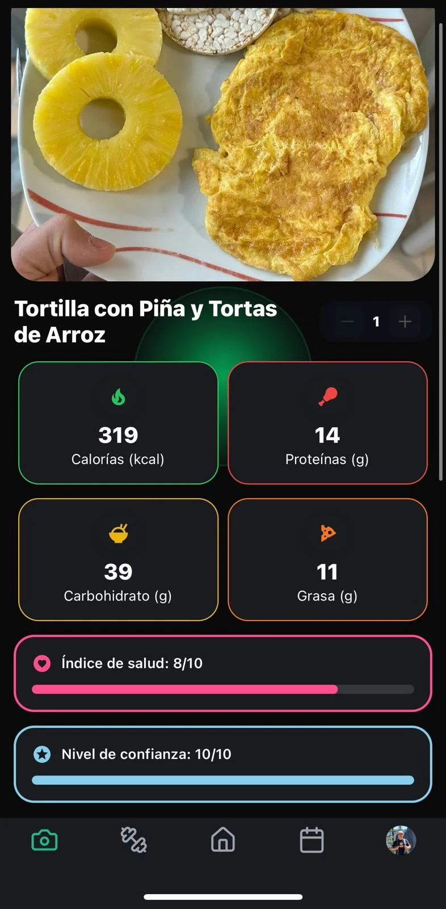<br/><sub><b>Review draft</b><br/>Edit portions before saving</sub></td>
<td width="25%" align="center">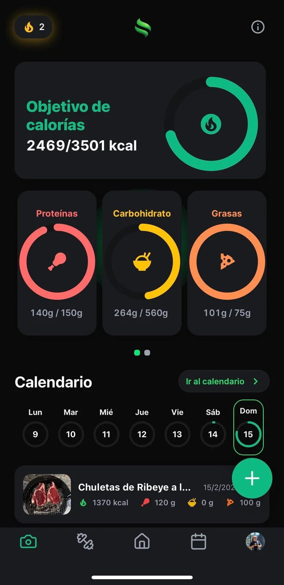<br/><sub><b>Concentric macro rings</b><br/>Protein · carbs · fat at a glance</sub></td>
<td width="25%" align="center">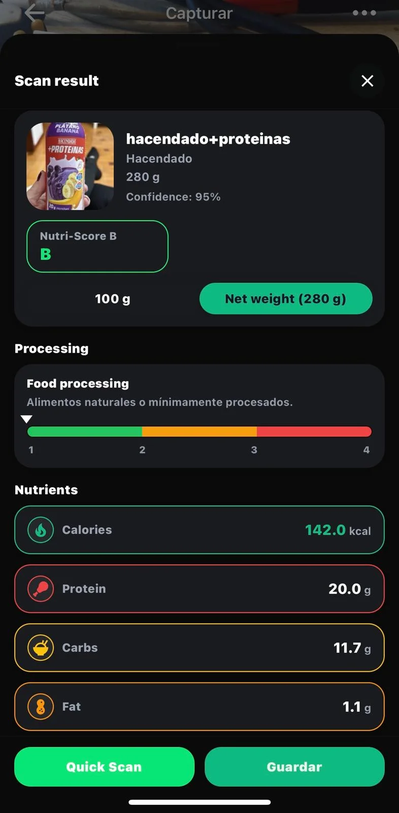<br/><sub><b>Daily breakdown</b><br/>Per-meal bars across the day</sub></td>
<td width="25%" align="center">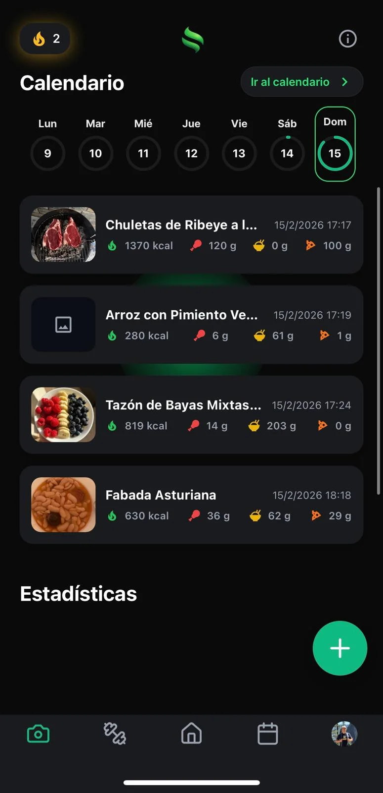<br/><sub><b>Weekly calendar</b><br/>Adherence at a glance</sub></td>
</tr>
</table>

Three ways to log: take a photo of your plate, scan a barcode, or just type what you ate. Behind the scenes, the photo flow uploads to Supabase Storage, hands a signed URL to GPT-4o Vision, and gets back a structured breakdown — name, portion, macros, confidence per item — in two to four seconds. You see a draft, edit it if you need to, and the rings close on save.

<details>
<summary><b>Under the hood</b></summary>

- **3 Edge Functions** power the analysis pipeline: `analyze-food-v2` (multimodal Vision call), `analyze-barcode` (Open Food Facts + AI fallback for unknown codes), `analyze-manual` (text-to-macros).
- `nutritionStore` (Zustand) holds the day's meals, weight logs and water intake. Selectors compute macro totals on every read so the rings stay in sync.
- The concentric rings are pure `react-native-svg` paths animated with `react-native-reanimated`. No third-party chart lib.
- Meals are persisted in Postgres with full edit history — change a meal three days later and the rings recompute backwards.
- 2026-04 migration added multi-plate meals so a shared lunch logs as one meal with multiple components.

</details>

---

### 💪 Workout

> Build your routine, then live-track every set, every rep, every second of rest. Spotter remembers your last weight, hints at progression, and times you between sets.

<table>
<tr>
<td width="25%" align="center">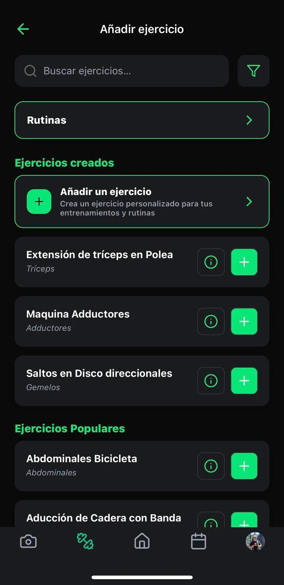<br/><sub><b>Exercise picker</b><br/>Search by muscle group or name</sub></td>
<td width="25%" align="center">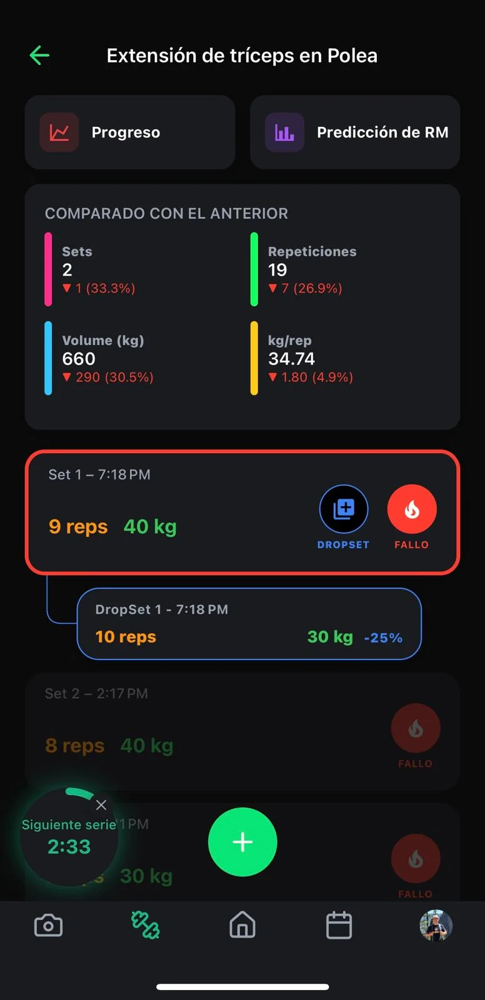<br/><sub><b>Set tracking</b><br/>Weight · reps · RPE · history hints</sub></td>
<td width="25%" align="center">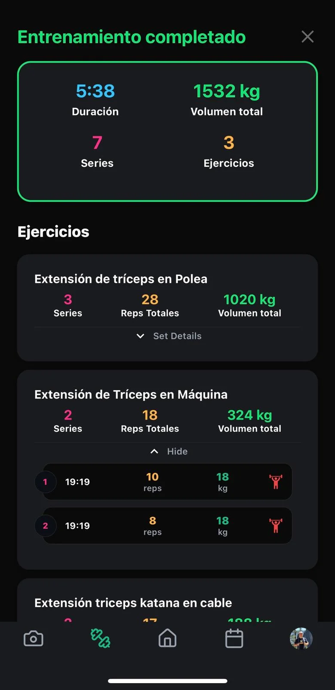<br/><sub><b>Workout summary</b><br/>Volume · PRs · time per muscle</sub></td>
<td width="25%" align="center">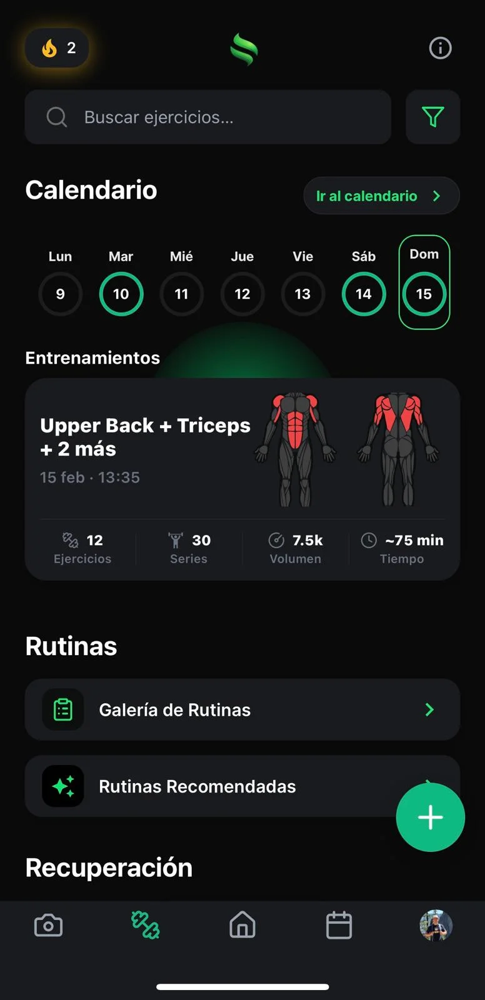<br/><sub><b>Workout calendar</b><br/>Training adherence at a glance</sub></td>
</tr>
</table>

Start a session and Spotter pulls your last numbers for every exercise so you never have to remember what you lifted last week. Supersets and drop-sets are first-class citizens. The rest timer runs in the background and pings you when it's time to lift again — phone in your pocket, eyes off the screen. When you finish, you get a summary with total volume, personal records and a body heatmap showing exactly which muscles took a beating.

<details>
<summary><b>Under the hood</b></summary>

- **Six Zustand stores** orchestrate the training engine: `workoutStore` (session lifecycle), `routineStore` (templates), `exerciseStore` (catalogue), `setStore` (live set entry), `cardioSetStore` (cardio), `restTimerStore`, plus `coachingStore` for progression suggestions.
- The live workout screen (`ActiveWorkoutScreen.tsx`) handles supersets, drop-sets, rest-pauses and per-set notes. On mount it fetches last-session values from Postgres so the previous numbers appear instantly.
- Recovery heatmap uses `react-native-body-highlighter`. Each completed exercise contributes weighted volume to its primary and secondary muscle groups; a 7-day decay function drives the colour intensity.
- Background haptics + push notifications fire when the rest timer ends.
- The `remotion/` folder generates shareable workout recap videos programmatically — work in progress.

</details>

---

### 👥 Social feed

> A real social network for the people in your life who actually train. Post a meal, a PR, a progress photo. Like, comment, follow. No algorithm hijacking your feed.

<table>
<tr>
<td width="33%" align="center">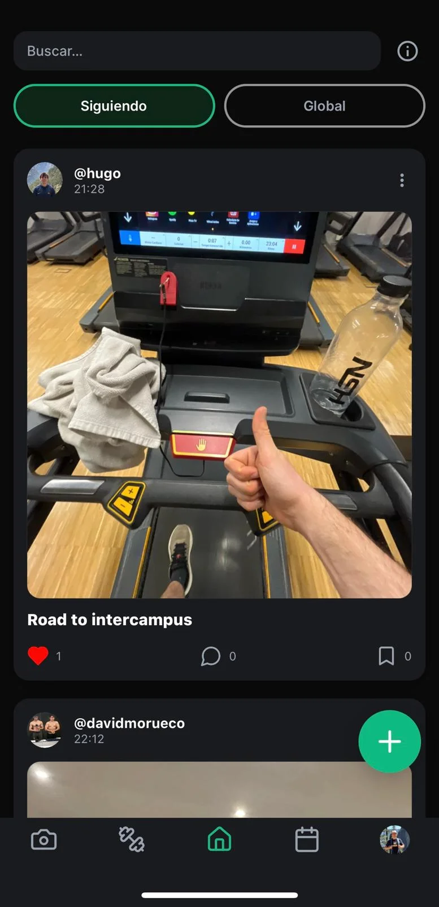<br/><sub><b>Feed</b><br/>Friends and people you follow</sub></td>
<td width="33%" align="center">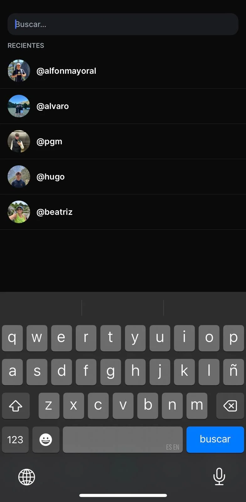<br/><sub><b>Discover</b><br/>Find users by handle, name or contacts</sub></td>
<td width="33%" align="center">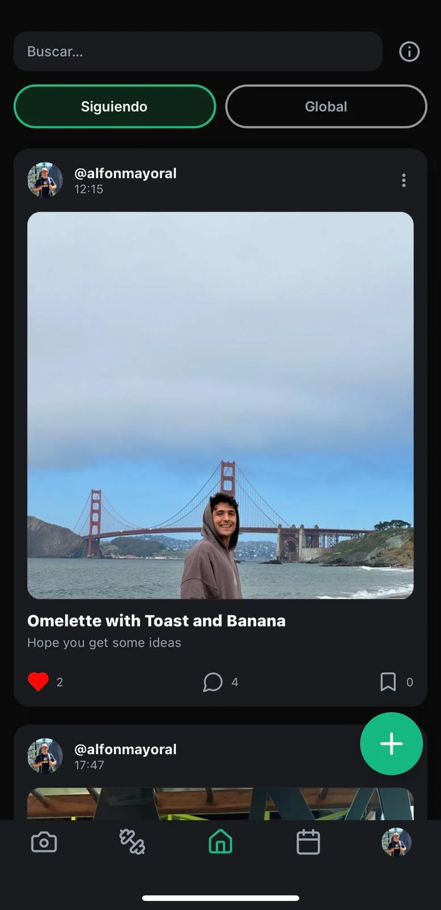<br/><sub><b>Reactions</b><br/>Like, comment, save</sub></td>
</tr>
</table>

Posts live chronologically, no engagement algorithm. Discover new friends through your existing contacts — Spotter hashes phone numbers locally before sending anything to the backend, so we never see who's actually in your address book. One-tap sharing pushes a workout summary straight into your Instagram Story with the right background.

<details>
<summary><b>Under the hood</b></summary>

- `socialStore` + `composeStore` coordinate feed state, drafts and uploads.
- Posts live in Postgres with public-by-default Row-Level Security; comments and likes are separate tables with foreign keys and cascade.
- Contact discovery (`discover-contacts` Edge Function) hashes numbers client-side before sending; the same hash is stored against existing users, so matching happens without the server ever seeing raw phone numbers.
- Newly uploaded media flows through `moderate-user-media` for automated content checks — required for App Store / Play Store compliance.
- Instagram Story sharing handled by `shareToInstagramStories.ts` via deep-linking with a pre-rendered background image.

</details>

---

### 🔥 Streaks, league & achievements

> Show up every day, build a streak, climb the weekly league. Gamification that rewards real consistency — not just opening the app.

<table>
<tr>
<td width="25%" align="center">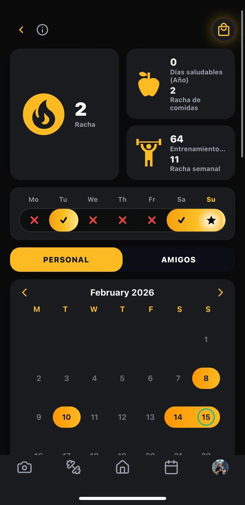<br/><sub><b>Daily streak</b><br/>Don't break the chain</sub></td>
<td width="25%" align="center">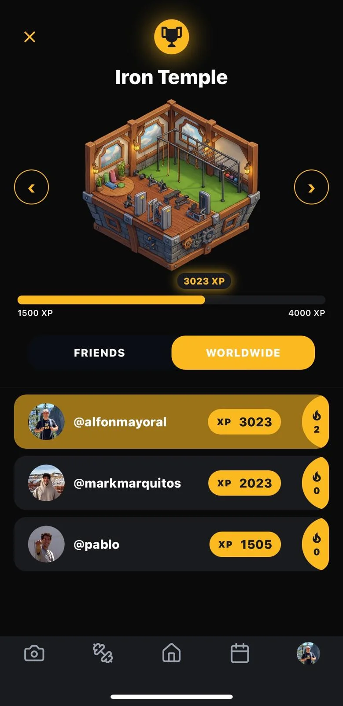<br/><sub><b>Weekly league</b><br/>Compete in a small bracket</sub></td>
<td width="25%" align="center">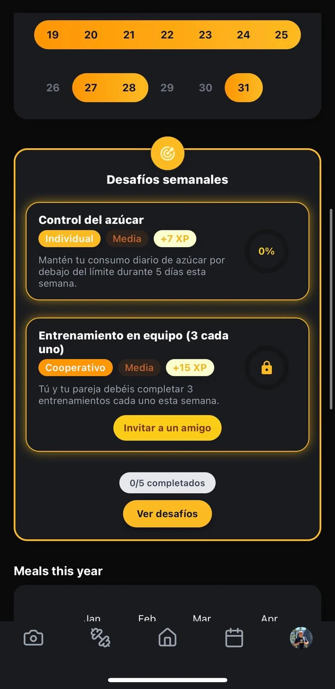<br/><sub><b>Challenges</b><br/>Time-limited goals with bonus XP</sub></td>
<td width="25%" align="center">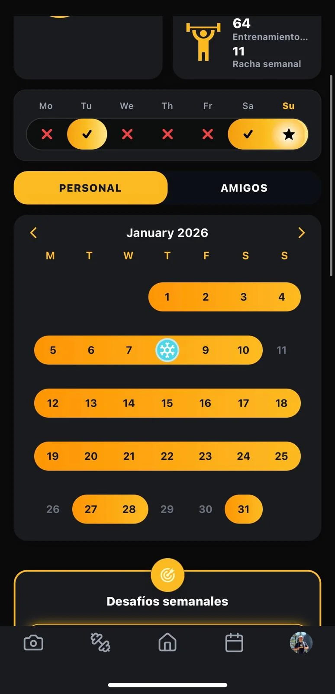<br/><sub><b>Streak calendar</b><br/>See every active day at a glance</sub></td>
</tr>
</table>

Every day you log something — a workout, a meal, a weight check — your streak grows. Miss a day? You've got one free freeze per week before the chain breaks. Weekly leagues group you with twenty other users and promote the top finishers; achievements unlock as you hit real milestones across every part of the app.

<details>
<summary><b>Under the hood</b></summary>

- `streakStore` + `achievementStore` keep the gamification layer in sync with backend triggers.
- Achievements are defined declaratively (JSON metadata + image assets). The `gen:achv` script regenerates the asset pipeline at install time so adding a new achievement is one PR.
- Leagues recompute weekly on the backend: users grouped into brackets of ~20 with promotion / relegation based on weekly XP.
- The "one freeze per week" mechanic has a measurable retention impact — missing a single day no longer resets months of progress.

</details>

---

### 📅 Calendar

> One unified timeline of your fitness life. Every workout, every meal, every weight check-in, in one place.

<table>
<tr>
<td width="33%" align="center">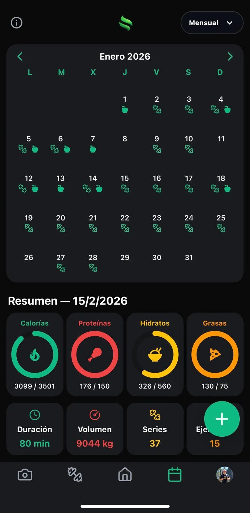<br/><sub><b>Month</b><br/>Birds-eye view of the whole month</sub></td>
<td width="33%" align="center">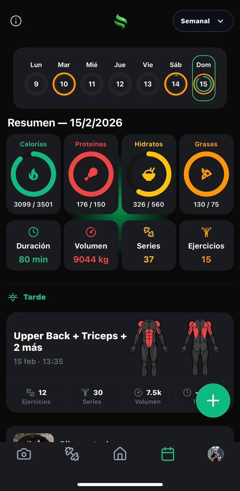<br/><sub><b>Week</b><br/>Side-by-side comparison across days</sub></td>
<td width="33%" align="center">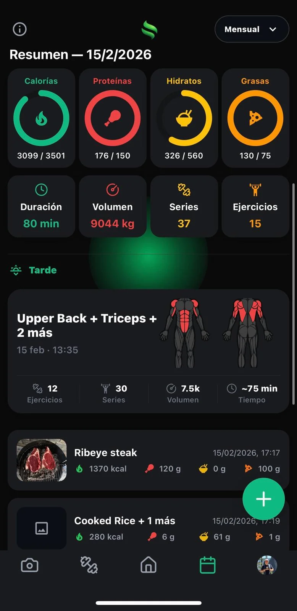<br/><sub><b>Day summary</b><br/>Macros · training time · weight</sub></td>
</tr>
</table>

The calendar is the answer to "wait, did I work out this week?" — a single screen that shows whether you actually did. Calorie ring, workout chip and streak flame summarised on every cell, with three zoom levels from month down to a single day.

<details>
<summary><b>Under the hood</b></summary>

- All three views read from cached Supabase queries via `dataCache.ts` — scrolling months back never triggers a new round-trip.
- Each calendar cell renders compact summary badges (calorie ring · workout chip · streak fire) computed from store selectors.
- Pure `dayjs` for date logic to keep the bundle small (we don't ship `moment`).

</details>

---

### 👤 Profile & analytics

> Your public profile, plus the private dashboard that shows what your habits actually look like over time.

<table>
<tr>
<td width="25%" align="center">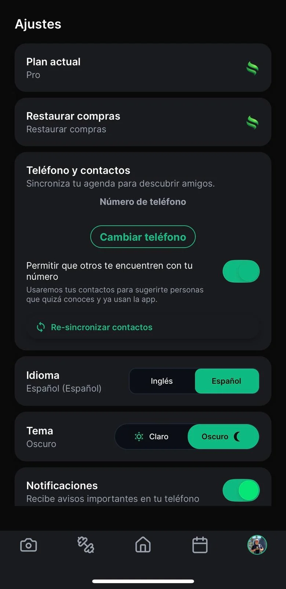<br/><sub><b>Settings</b><br/>Account · units · privacy</sub></td>
<td width="25%" align="center">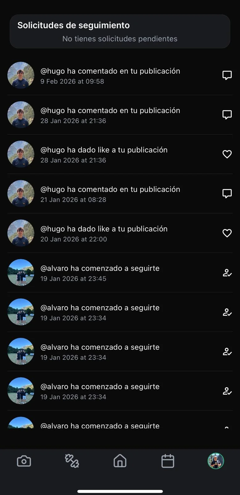<br/><sub><b>Notifications</b><br/>Per-channel push controls</sub></td>
<td width="25%" align="center">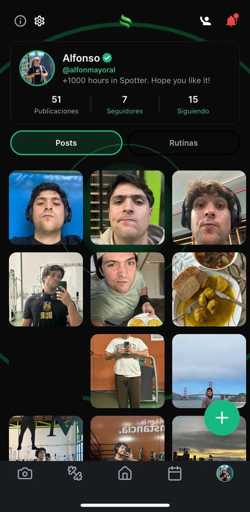<br/><sub><b>Your posts</b><br/>Public grid view</sub></td>
<td width="25%" align="center">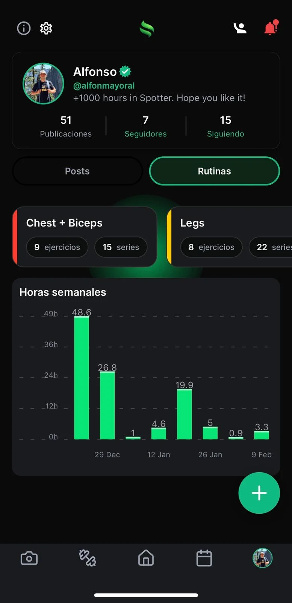<br/><sub><b>Your routines</b><br/>Reusable workout templates</sub></td>
</tr>
</table>

A clean public profile (posts grid + routines + bio), backed by a private analytics layer that tracks weight, body composition and adherence over time. The app prompts you for a weekly weight check at smart moments and surfaces short, ranked recommendations based on what you actually did the last two weeks — never more than three at a time so it never feels like nagging.

<details>
<summary><b>Under the hood</b></summary>

- Four stores coordinate this surface: `profileStore`, `coachingStore`, `recommendationsStore` and `comparisionMetricsStore`.
- `weight-prompt` Edge Function schedules a smart weekly reminder; the prompt is dismissable per-user via `notificationStore`.
- Recommendations engine combines simple rules with GPT-generated tips off the last 14 days of data, capped at 3 suggestions ranked by predicted impact.
- Configuration screen wires up `expo-store-review`, `expo-secure-store`, RevenueCat subscription management, GDPR-compliant account deletion (`delete-account` Edge Function) and the mandatory App Store age-rating flow.

</details>

---

## Tech stack

| Layer | What we use |
| --- | --- |
| **Mobile framework** | React Native 0.81 · Expo SDK 54 · Expo Router (file-based) |
| **Language** | TypeScript 5.9 in strict mode |
| **State** | Zustand 5 — 21 domain stores with AsyncStorage persistence |
| **UI / animation** | `react-native-reanimated` · `react-native-svg` · `react-native-paper` · Lucide icons |
| **Charts** | `react-native-chart-kit` · `react-native-svg-charts` · `react-native-body-highlighter` · radar charts |
| **Backend** | Supabase — Postgres + Auth + Realtime + Storage + 18 Edge Functions |
| **AI** | OpenAI GPT-4o (Vision + text) for food analysis, recommendations, weight prompts |
| **Subscriptions** | RevenueCat (App Store + Google Play, unified analytics + webhooks) |
| **Auth** | Email · Apple · Google · phone (libphonenumber-js) |
| **Push notifications** | Expo Push Service with backend fan-out via `send-push-from-notification` |
| **Build & release** | EAS Build · EAS Submit · EAS Update (OTA) |
| **i18n** | i18next + i18next-icu, EN + ES (auto-scanned via `i18next-scanner`) |
| **Video** | `expo-video` for exercise demos · `remotion` for programmatic workout recaps |
| **Quality** | ESLint 9 · Prettier · Husky · lint-staged · `tsc --noEmit` on every commit |

---

## By the numbers

| | |
| ---:| --- |
| **748** | commits over 10 months |
| **106** | pull requests merged into `main` |
| **370+** | TypeScript files, all strict-typed |
| **21** | Zustand stores, one per domain |
| **18** | Supabase Edge Functions in production |
| **2** | languages from day one (English + Spanish) |
| **1,000+** | downloads across App Store + Google Play |
| **400+** | monthly active users |

---

## Get in touch

Spotter AI is built and run by **Alfonso Mayoral** — founder, full-stack engineer, designer, and the very first user the app was built for.

<div align="center">

[](mailto:alfonsomayoral29@gmail.com)
[](https://portfolio-website-two-rho-44.vercel.app/)
[](https://www.linkedin.com/in/alfonsomayoral/)
[](https://github.com/alfonsomayoral)

</div>

---

<div align="center">

_Built with care. Shipped to real users. Iterated weekly._

</div>
